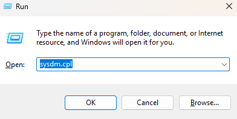
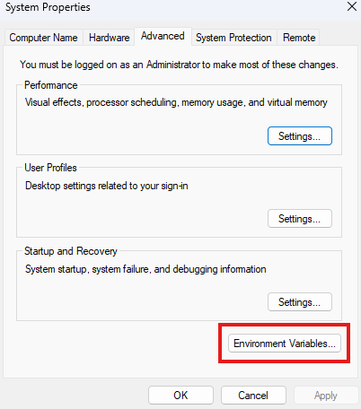
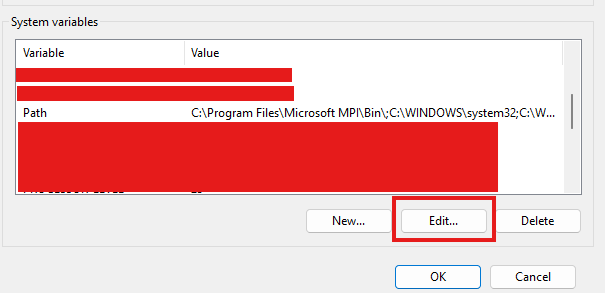
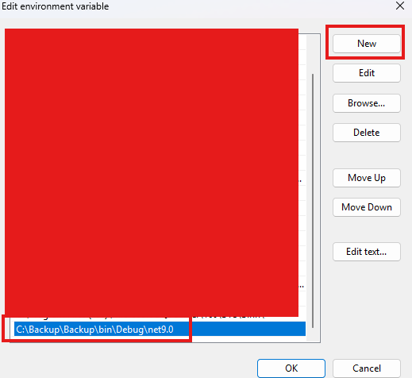
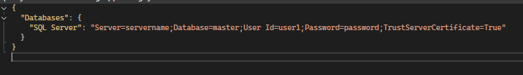

<!--  -->
<!--  -->

# Database Backup

This C# console application provides a convenient interface for manually backing up your Microsoft SQL Server databases.

<!-- 
## Getting Started

These instructions will give you a copy of the project up and running on
your local machine for development and testing purposes. See deployment
for notes on deploying the project on a live system. -->

## Prerequisites

Requirements for the software to work

1. Download and install ASP.NET Core Runtime 9.0.0
2. Download and install SQL Server

## Features:

1. **User-Driven Backups**: Easily initiate database backups on demand.
2. **User-Friendly Interface**: Intuitive console interface for easy navigation and execution.
3. **NET 9 Framework**: Built on the latest .NET framework for optimal performance and compatibility.
4. **SQL Server Support**: Currently supports Microsoft SQL Server databases. Support for other databases will be added in future releases.

## Installing

A step by step series of examples that will show you how to get program to run on CLI from anywhere

1. **Clone the repository:**

    1.1. Clone the repository onto your local machine at root level

        https://github.com/Kennedy-was-taken/database.git

    1.2. You can delete the TestDatabase folder as there is no need for that folder

2. **Set up environment:**

    2.1. Copy the path where the is found database.exe. example :

        \database\database\bin\Debug\net9.0

    2.2. Open run `win + r`

    

    2.3. Type `sysdm.cpl` to open system properties, click on the Advance tab. Under the Advance tab, click on the Environment Vairable button.

    

    2.4. Under the system variable, select "Path" and click the edit button.

    
    
    2.5. Click the "New" button and paste in the relative path you copied and click "OK" to accept all changes.

    

    2.6. Now the program can be called from anywhere by typing `database` on the CLI

3. **Set up DataBase Configuration:**

  3.1. Open the file appsetting.json found here 

    "C:\database\database\appsettings.json"

  3.2. Replace the "Server" name with your Sql server name, replace "User ID" with your account username and replace "Password" with the account user's password

  

 ## Backup file location

The generated backup file .bak will be stored in the default Backup location e.g :

    C:\Program Files\Microsoft SQL Server\MSSQL16.MSSQLSERVER\MSSQL\Backup

 ## Future Updates

 Well be working on adding Postgre and Oracle next.